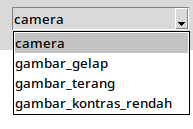
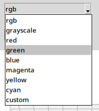
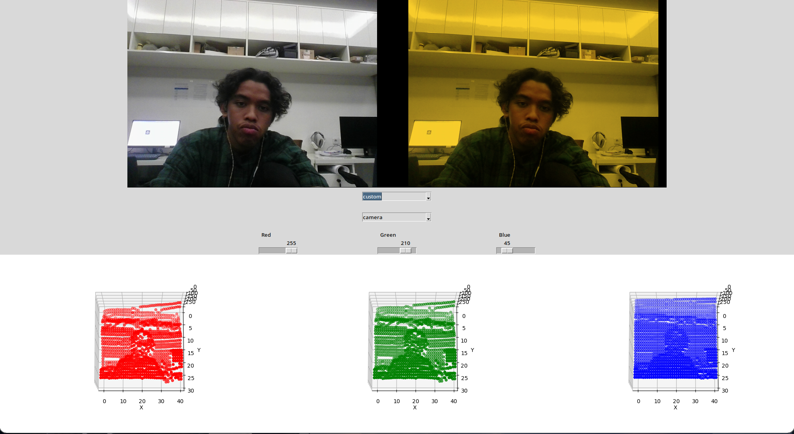

# PCV_Tugas_1 

---

Program ini merupakan program yang memiliki fungsi menampilkan gambar atau hasil tangkap camera. Terdapat beberapa fitur yang ada di program ini antara lain sebagai berikut.

- Mode menampilkan foto
- Mode menampilkan camera (default)
- Filter warna (default : RGB)
- Tampilan channel warna

### Mode menampilkan foto 

Untuk menentukan gambar dapat dilakukan dengan memasukkan gambar pada folder `/foto`. Ubah directory pada program sesuai dengan foto yang diinginkan.

```
GAMBAR_KONTRAS_RENDAH = "foto/lowcontrast.jpeg"
GAMBAR_GELAP = "foto/lowlight.jpeg"
GAMBAR_TERANG = "foto/toomuchlight.jpeg"  
```
Mode dapat diganti dengan mengatur menu dropdown `Camera`.


### Filter warna

Terdapat beberapa preset filter warna yang tersedia seperti berikut.

- RGB (default)
- grayscale
- red
- green
- blue
- cyan
- magenta
- yellow
- custom


Mode `custom` merupakan mode pengaturan intensitas setiap channel warna secara independen. Setiap channel dapat diatur nilai maksimumnya dari 0 hingga 255. 


